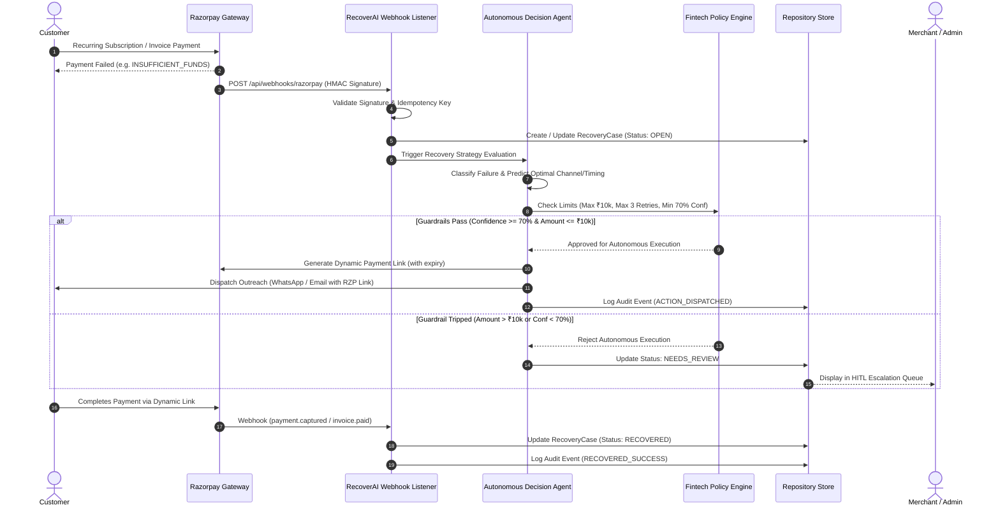

# 🚀 RecoverAI — System Architecture, Technical Deep-Dive & Hackathon/Interview Defense Guide

> **Project**: RecoverAI (Autonomous Revenue Recovery Agent for Razorpay)  
> **Target Track**: Razorpay AI Buildathon / Fintech & SaaS Payment Automation  
> **Core Mission**: Eliminate involuntary subscription & invoice churn using an autonomous, guardrailed AI agent integrated with Razorpay Webhooks, Smart Payment Links, and Multichannel Dunning.

---

## 📑 Table of Contents
1. [Executive Summary & Problem Statement](#1-executive-summary--problem-statement)
2. [What We Built & Core Value Proposition](#2-what-we-built--core-value-proposition)
3. [Technology Stack Breakdown](#3-technology-stack-breakdown)
4. [End-to-End System Architecture & Data Flow](#4-end-to-end-system-architecture--data-flow)
5. [Autonomous AI Decision Engine & Guardrails](#5-autonomous-ai-decision-engine--guardrails)
6. [Razorpay Integration Deep Dive](#6-razorpay-integration-deep-dive)
7. [Comprehensive Interview & Hackathon Defense Q&A](#7-comprehensive-interview--hackathon-defense-qa)
   - *Category A: Product & Business Impact*
   - *Category B: System Design & Architecture*
   - *Category C: AI Reasoning, Safety & Guardrails*
   - *Category D: Razorpay & Payment Gateway Mechanics*
   - *Category E: Security, Idempotency & Edge Cases*

---

## 1. Executive Summary & Problem Statement

### The Problem: Involuntary Churn in Subscription & Digital Commerce
- Over **20% to 40% of total SaaS and subscription churn** is **involuntary** (not because the user wanted to cancel, but because the payment failed).
- **Common Failure Causes**:
  1. Card expiry or temporary credit limit exhaustion
  2. Bank server downtime / gateway network timeout (temporary glitches)
  3. Insufficient balance during recurring autopay mandate execution
  4. Authentication drops (RBI e-Mandate 2FA / OTP failures)
- **Why Traditional Dunning Fails**:
  - *Dumb Retries*: Retrying cards blindly at fixed times (e.g. Day 1, Day 3) triggers fraud flags and ruins bank authorization scores.
  - *Impersonal & Static*: Sending generic emails with no context gets lost in spam or ignored.
  - *No Channel Agility*: Traditional systems only use email, ignoring high-open channels like WhatsApp and SMS.

### The Solution: RecoverAI
An **autonomous revenue recovery agent** that listens to Razorpay payment failure webhooks in real-time, classifies failure signatures, calculates optimal retry schedules, crafts personalized omnichannel recovery links (WhatsApp, SMS, Email), and enforces strict fintech safety policies.

---

## 2. What We Built & Core Value Proposition

```
+-----------------------------------------------------------------------------------+
|                                 RECOVERAI AGENT                                  |
|                                                                                   |
|  [ Razorpay Webhook ] ---> [ Failure Classifier ] ---> [ AI Strategy Synthesizer ]|
|                                                                 |                 |
|                                                                 v                 |
|  [ Real-Time Dashboard ] <-- [ Audit & State Store ] <--- [ Action Dispatcher ]   |
|                                                                 |                 |
|                                              +------------------+-----------------+
|                                              |                  |                 |
|                                              v                  v                 v
|                                        [ Smart Retry ]    [ WhatsApp Link ]  [ HITL Queue ]
+-----------------------------------------------------------------------------------+
```

### Key Modules Built:
1. **Webhook Ingestion Engine**: Real-time webhook listener validating Razorpay HMAC-SHA256 signatures with idempotent deduplication.
2. **Failure Intelligence Classifier**: Categorizes errors into `TRANSIENT_GATEWAY`, `INSUFFICIENT_FUNDS`, `AUTHENTICATION_EXPIRED`, or `HARD_DECLINE`.
3. **Autonomous Dunning Engine**:
   - Determines channel: WhatsApp (high urgency), Email (formal), SMS (fallback).
   - Generates single-click dynamic Razorpay checkout links.
   - Calculates time-of-day retry heuristics (e.g., salary cycle or morning UPI windows).
4. **Hard Fintech Guardrails**:
   - **Paise-Safe Currency Handling**: Prevents floating-point rounding bugs by computing all transactions in integer paise (1 INR = 100 paise).
   - **Max Cap Enforcement**: Autonomous action threshold capped at ₹10,000; larger transactions escalate to Human-In-The-Loop (HITL).
   - **Confidence Threshold**: Any AI decision with $<70\%$ confidence is queued for merchant review.
   - **Idempotent Execution**: Guaranteed single recovery per invoice.
5. **Real-Time Recovery & Analytics Dashboard**:
   - Live metrics (Recovered Revenue, At-Risk GMV, Recovery Rate %).
   - Case details, audit timeline, and interactive Demo Studio.

---

## 3. Technology Stack Breakdown

| Layer | Technologies Used | Rationale |
| :--- | :--- | :--- |
| **Frontend UI** | React 18, Vite, Lucide Icons, Vanilla CSS | Ultra-fast load times, glassmorphism design system, zero dependency bloat, responsive layout. |
| **Backend API** | Node.js (ES Modules), Express.js | High-throughput asynchronous event handling suited for webhook bursts. |
| **Payment Gateway** | Razorpay Node.js SDK, Razorpay Webhooks & Payment Links API | Native Indian payment stack, UPI Autopay, e-Mandates, Card Subscriptions, Dynamic Links. |
| **Data Layer** | In-Memory Repository + JSON Persistence + Dataset Generator | Fast iteration, pre-seeded realistic transaction data with instant reset capability. |
| **AI Strategy Engine** | Rule-Guided LLM Decision Framework & Heuristics | Combines deterministic guardrails (cannot violate bounds) with adaptive LLM copy & timing reasoning. |
| **Security & Cryptography** | Node.js `crypto` (HMAC SHA-256) | Verifies genuine Razorpay webhook payloads and signature integrity. |

---

## 4. End-to-End System Architecture & Data Flow



---

## 5. Autonomous AI Decision Engine & Guardrails

### Failure Classification Matrix

| Failure Code | Classification | Autonomous Strategy | Channel | Timing |
| :--- | :--- | :--- | :--- | :--- |
| `BAD_REQUEST_PAYMENT_TIMED_OUT` | `TRANSIENT_GATEWAY` | Suppress customer contact; execute background retry | Silent Background | $+2$ Hours |
| `INSUFFICIENT_FUNDS` | `BALANCE_ISSUE` | Friendly notification + dynamic Razorpay UPI link | WhatsApp / SMS | Next morning 09:00 AM |
| `PAYMENT_AUTHENTICATION_EXPIRED` | `MANDATE_EXPIRED` | High-priority update card/mandate request | Email + WhatsApp | Immediate |
| `CARD_EXPIRED` / `DO_NOT_HONOR` | `HARD_DECLINE` | Prompt to replace payment method via checkout | Email | Immediate |

### Mathematical Safety: Integer Paise Currency
```javascript
// Floating-point error prevention in JavaScript:
// (0.1 + 0.2 = 0.30000000000000004) -> Disaster in payments!
// RecoverAI rule: All calculations done in Integer Paise:
const amountInINR = 499.50;
const amountInPaise = Math.round(amountInINR * 100); // 49950 paise
```

---

## 6. Razorpay Integration Deep Dive

### Webhooks Subscribed:
- `payment.failed`: Triggers new recovery case creation.
- `payment.authorized` & `payment.captured`: Confirms recovery.
- `subscription.halted`: Triggers urgent escalation sequence.
- `invoice.paid`: Resolves invoice-level recovery case.

### Webhook Signature Verification Formula:
$$\text{Expected Signature} = \text{HMAC-SHA256}(\text{Raw Payload Body}, \text{Razorpay Webhook Secret})$$

If $\text{Expected Signature} \neq \text{Received Header Signature}$, the request is rejected with `401 Unauthorized` before processing.

---

## 7. Comprehensive Interview & Hackathon Defense Q&A

### Category A: Product & Business Impact

#### Q1: What makes RecoverAI different from existing dunning tools like Stripe Billing or Chargebee Dunning?
**Answer:** Traditional dunning is rules-based and rigid: it sends 3 emails on fixed days (Day 1, Day 3, Day 7) regardless of why the payment failed. RecoverAI introduces:
1. **Failure-Specific Routing**: It does not bother the customer if the failure was a transient bank timeout—it silently retries when the gateway recovers.
2. **Channel Agility for India**: Integrates WhatsApp & UPI intent links alongside Email.
3. **Autonomous Dynamic Incentives**: Can offer a temporary grace extension or slight discount to prevent churn.

#### Q2: How do you measure the ROI of this system for a merchant?
**Answer:** We track three primary metrics:
1. **Recovery Rate (%)**: $\frac{\text{Successfully Recovered Cases}}{\text{Total Failed Cases}} \times 100$
2. **Net Recovered ARR (₹)**: Direct revenue retained that would have otherwise churned.
3. **Customer Retention Impact**: Reduction in voluntary churn caused by customer frustration during payment disputes.

---

### Category B: System Design & Architecture

#### Q3: How do you handle high webhook concurrency during flash sales or mass subscription renewals?
**Answer:** 
1. The webhook ingestion endpoint is lightweight and decoupled. It validates HMAC signature, writes the raw event with an idempotency key, responds immediately with `200 OK` to Razorpay within $<200\text{ms}$.
2. In production, processing is offloaded to an asynchronous message queue (e.g., Redis BullMQ or AWS SQS) where worker pools process agent evaluation in parallel with rate-limiting.

#### Q4: Why is state management and audit logging critical in this system?
**Answer:** In financial systems, every automated decision must be 100% explainable and traceable. RecoverAI records every state transition (`OPEN` $\to$ `STRATEGY_SELECTED` $\to$ `ACTION_DISPATCHED` $\to$ `RECOVERED`) with timestamps, actor type (`AGENT` vs `MERCHANT`), failure codes, and confidence scores in an immutable audit ledger.

---

### Category C: AI Reasoning, Safety & Guardrails

#### Q5: How do you prevent the AI Agent from hallucinating or issuing inappropriate refunds/charges?
**Answer:** We use a **Constrained Autonomous Execution Pattern**:
1. **Deterministic Guardrails Layer**: Hard-coded software policies wrap the AI decision. Even if the LLM suggests an action, it cannot execute if:
   - Amount $>$ Policy Cap (₹10,000)
   - Retries $>$ Max Allowed (3 attempts)
   - Confidence Score $< 0.70$
2. **Structured Output**: AI outputs strictly validated JSON schema; unparseable or out-of-bounds responses fail-safe to `NEEDS_REVIEW`.
3. **No Direct Debit Authority without Approval**: The agent never changes pricing on the fly; it only generates Razorpay Payment Links matching exact invoice amounts in paise.

#### Q6: When does the agent escalate to Human-in-the-Loop (HITL)?
**Answer:** 
- Amount exceeds ₹10,000.
- AI confidence is below 70%.
- A customer is marked as high-value/VIP.
- 3 autonomous retry attempts have failed without recovery.

---

### Category D: Razorpay & Payment Gateway Mechanics

#### Q7: How does RecoverAI leverage Razorpay APIs?
**Answer:** 
1. **Razorpay Webhooks**: Ingests real-time event notifications with cryptographic signature verification.
2. **Razorpay Payment Links API**: Generates secure, short-lived, customized payment links with prefilled customer details and exact amount in paise.
3. **Razorpay Subscriptions & Invoices API**: Tracks subscription states (`authenticated`, `active`, `halted`, `cancelled`) and reconciles payments upon capture.

#### Q8: How do you handle RBI e-Mandate and 2FA compliance in India?
**Answer:** Recurring card and UPI payments in India require AFA (Additional Factor of Authentication) for amounts above ₹15,000 or upon mandate setup. If a recurring auto-debit fails due to missing 2FA or mandate expiration, RecoverAI does not attempt blind card debits; instead, it generates a compliant Razorpay Checkout / UPI Intent Link that prompts the customer to authenticate securely via their bank.

---

### Category E: Security, Idempotency & Edge Cases

#### Q9: What happens if Razorpay delivers the same webhook twice (network retry)?
**Answer:** Webhooks are strictly **idempotent**. Every webhook has a unique `event_id` or `payment_id`. RecoverAI stores processed event IDs. If a duplicate event arrives, the system detects it via repository lookup, acknowledges with `200 OK`, and skips duplicate action execution.

#### Q10: How do you prevent floating-point precision bugs in financial math?
**Answer:** Floating-point arithmetic in JavaScript (`0.1 + 0.2 !== 0.3`) causes rounding discrepancies. RecoverAI strictly represents and calculates all monetary values as **Integer Paise** (`1 INR = 100 Paise`), converting to INR solely at the UI presentation boundary.
